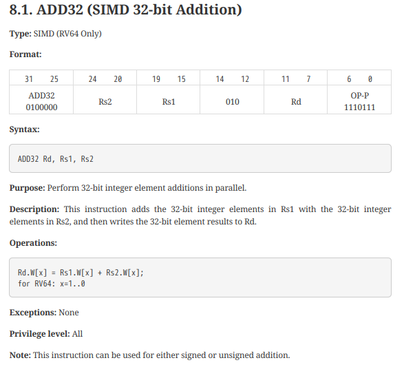

ALU implementation for RISC-V P-extension
=======================

## INTRODUCTION

### Description:

RISC-V P-extension is a specification of RISC-V instructions that would allow creating very 
area efficient digital signal processing-oriented processors. 

In normal 32-bit RISC-V specification, the input data is 32-bit wide. That means that the 
ALU will receive 2-3 input operands, each 32-bit wide. So will the P-extension ALU. 

In normal RISC-V, the ALU performs an operation on those 32-bit operands, e.g. a+b or a-b, 
where a and b are 32-bit wide.

In P-extension ALU, one operand, say a, is divided into 2 or 4 operands, each being 16 or 8 
bits wide. Similarly for b operand. Then, these new operands are utilized for addition, or 
similar, operations.

It uses single instruction multiple data (SIMD), a type of parallel computing architecture 
where a single operation is performed on multiple data points simultaneously.

### Specification:

Following six instructions were implemented out of the 30 + SIMD instructions of RISC 
V P-extension:
* 32-bit addition (PADD.W)
* 32-bit subtraction (PSUB.W)
* 16-bit addition (PADD.H)
* 16-bit subtraction (PSUB.H)
* 16-bit Cross Add & Sub (PAS.HX)
* 16-bit Cross Sub & Add (PSA.HX)

#### 32-bit addition (PADD.W)

#### 32-bit subtraction (PSUB.W)

#### 16-bit addition (PADD.H)

#### 16-bit subtraction (PSUB.H)

#### 16-bit Cross Add & Sub (PAS.HX)

#### 16-bit Cross Sub & Add (PSA.HX)

## APPLICATIONS

### Application 1:

This article proposes a packed SIMD approach for complex signed sum (ADDC16), 
subtraction(SUBC16), crossed sum/subtract (CRASC16), and crossed subtract/sum 
(CRSAC16).

These complex arithmetic operations are used in DSP algorithms like Gaussian
frequency shift keying (GFSK) modulation, LoRa preamble detection and Fast Fourier 
Transform (FFT) that are commonly employed in  popular IoT communication 
protocols such as Bluetooth LE, LoRa and Sigfox .

### Application 2:

The fast deployment of IoT (Internet-of-Things) devices for a few years has been impressive and 
the progressive deployment of 5G will accelerate things even further.  This trend will be 
characterized by a convergence of communication networks, merging several physical layers and 
different communication standards (e.g. 4G, Wi-Fi, LTE, RFID tags. . . ). Such heterogeneous 
networks have to deal with several different channel codes, different throughput targets and/or 
different energy consumption constraints. These results in the need for flexible implementations 
of different families of codes as for instance, Turbo, LPDC and Polar codes.

In this article, the approach aims at evaluating the performances (in terms of throughput and 
latency) of the main families of modern ECC codes targeting well-known embedded RISC-V 
processor cores. In order to improve the adequacy between these custom-tuned algorithms and 
the embedded processor architectures, an extension of their standard instruction set with 
carefully designed custom instructions is proposed. 

## RESULTS

### Output Waveform:

### Schematic:

#### RTL Schematic of RISC V ALU:

The RTL schematic of the ALU by default utilizes carry ripple adder as can be seen below in the figure:

#### RTL Schematic of RISC V ALU (after Synthesis):

After synthesis, the adder topology is changed from carry ripple adder to carry lookahead adder which is much faster then the latter and can be clearly observed in the figure below:

### Reports:

#### Power Consumption Report:

#### Area Report:

